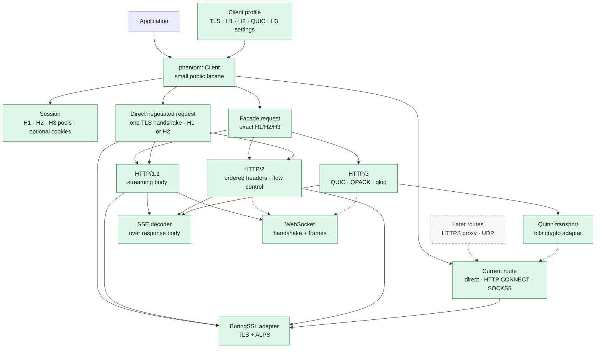
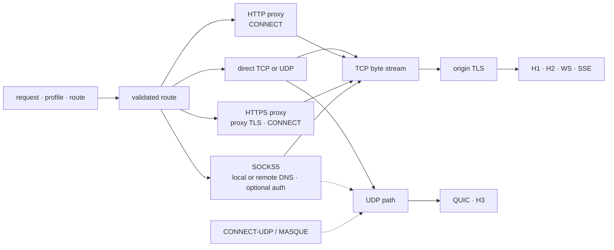
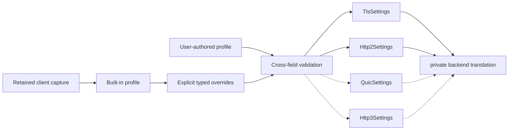
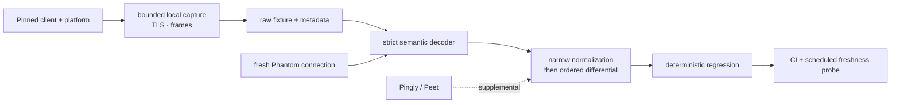

# Architecture

Phantom is a Rust-native client whose observable wire behavior is driven by a
validated client profile. The current workspace owns profiles, a small routed
H1/H2/H3 client facade, concrete request paths, session-owned H1/H2/H3 reuse,
optional bounded cookies, and the validation harness. Later slices extend
session behavior. Phantom carries narrow,
documented patches to upstream protocol engines only where their public APIs
cannot preserve a measured client behavior.

That is the deliberate middle ground between wrapping curl and writing every
protocol from scratch. curl and curl-impersonate remain valuable reference
implementations and comparison targets, but making libcurl the runtime core
would put Rust ownership, asynchronous streaming, H3 diagnostics, and exact
wire controls behind a C compatibility boundary. Reimplementing TLS, HPACK, or
QUIC would add risk without improving Phantom's actual differentiator.

## Runtime shape

Solid boxes exist today. Dashed boxes are planned seams and are not public API
commitments.



The optional SSE decoder is a response-body consumer, not another transport.
The current WebSocket slice owns an ordered H1 opening handshake and a bounded
message facade while reusing the selected route and TLS connector. Its frame
state machine is delegated to `tokio-tungstenite`; Phantom does not delegate
header serialization, handshake validation, routing, or public types.
H2 extended CONNECT and H3 WebSocket remain evidence-gated follow-up work.
H3 gets a separate QUIC path because forcing TCP and QUIC through one transport
trait would hide protocol-specific lifecycle, telemetry, and fingerprint
controls.

The direct negotiated request path is deliberately narrower than the exact
paths. It validates a request for both H1 and H2 before I/O, performs one TLS
handshake, then consumes that same stream with the selected engine. It never
probes with one exact connector and reconnects with another. H2 selection
reuses the exact connector's ALPS decoding and connection metadata handoff.
The path is bare-client and direct-only until pooling and route identity have
their own negotiated-protocol design.

All three transports return the standard `http::Response` semantic view and
attach `OrderedResponseHeaders` to its extensions. This sidecar retains global
ordinary-field order and duplicate interleaving without replacing the Rust
ecosystem's normal response type. HTTP/1 also retains received field-name
spelling; HTTP/2 and HTTP/3 names are lowercase by protocol. A transport fails
explicitly if its engine does not supply the ordered view, so this contract
cannot silently degrade to `HeaderMap` iteration.

## Routing and proxy seam

Route selection is a peer of profile selection, not a request-header trick. A
route is resolved before a connection is opened and, once pooling or racing
exists, every attempt remains on that route. Failure of a proxy never causes a
direct-network fallback.



The current proxy slices cover plaintext HTTP CONNECT and local- or remote-DNS
SOCKS5, with optional RFC 1929 username/password credentials, for H1/H2
origin TLS and H1 WebSocket. Direct H3 uses UDP. Selecting H3 with either
TCP-only proxy route fails before proxy or origin I/O because those routes have
no UDP capability. The client or request owns the route, and the HTTP CONNECT
field sequence contains one typed destination-authority placeholder.
Validation happens before proxy I/O. Negotiation is bounded, accepts a final
2xx after bounded informational responses, preserves bytes read beyond the
response head, and never retries direct. Hostnames, IPv4, and bracketed IPv6
endpoints have local coverage.

The SOCKS5 route uses `socks5://` for local origin DNS and `socks5h://` for
proxy-owned origin DNS. Local resolution preserves resolver order, opens a
fresh proxy connection for each eligible address attempt, and never opens a
direct origin connection. URI credentials, paths, and queries remain invalid;
`Socks5Proxy::with_username_password` owns and validates credentials outside
the endpoint string. Credentials participate in route equality and H1/H2 pool
identity but never in debug output, errors, or traces. Negotiation
uses a maintained protocol engine; Phantom owns route validation, error
categories, tracing, and fallback policy. See [proxy routing](proxy-routing.md).

HTTP forwarding, TLS-to-proxy CONNECT, HTTP proxy authentication challenges,
custom SOCKS5 resolvers, IDNA normalization, and half-close behavior remain
later slices. SOCKS5 GSSAPI is unsupported.

H3 is capability-checked separately. A TCP CONNECT proxy cannot carry QUIC.
SOCKS5 UDP ASSOCIATE is the first UDP proxy target, followed by CONNECT-UDP and
MASQUE; until one is implemented, forced H3 over that route returns an explicit
unsupported-route error. Protocol racing must never send its H3 leg directly
when the configured proxy lacks UDP support.

Connection reuse keys include the physical route, origin and SNI, negotiated
protocol, complete wire profile identity, proxy scheme and endpoint, auth
identity, DNS mode, and local bind settings. Rotation therefore cannot reuse a
connection opened through another proxy. Cookies, tickets, DNS/Alt-Svc state,
and mutable request defaults remain session-scoped rather than process-global.

## Pooling and multiplexing

The connection pool owns physical connections, capacity, and waiter admission;
the session owns logical cross-request state. HTTP/1.1 connections admit one
active exchange and are reused sequentially, with pipelining disabled. HTTP/2
and HTTP/3 connections admit concurrent streams up to the minimum of the
peer-advertised limit and a configured local bound. There is no generic
`multiplex` switch: capacity, flow control, priority, and draining follow the
selected protocol and profile.

Pending admission is bounded and cancellation-safe. Cancelling one H2 or H3
request resets only its stream; it does not discard unrelated streams. A
GOAWAY marks the connection draining, prevents new admission, and lets eligible
in-flight work finish. The H2 pool retries one bodyless GET when a graceful
GOAWAY identifies it as unprocessed; every broader retry decision remains
outside the pool and requires an explicit replayability contract. SSE leases a
long-lived response stream, while WebSocket leases one upgraded or
extended-CONNECT stream; either can coexist with ordinary H2/H3 requests.

Cross-origin coalescing is disabled in the first pooled slice. It is enabled
only after certificate authority, DNS/route identity, origin authorization,
profile compatibility, and the selected stack's observable behavior are all
proven. A connection is never shared across profile generations or route
identities merely because two requests resolve to the same address.

The current public pool is deliberately narrower than this final contract. A
`Session` retains one reusable H1, H2, or direct H3 connection per exact
origin-and-route key, serializes same-key cold connection setup, and evicts
least-recently selected retained entries at configurable bounds. Different
sessions never share connections. H1 is sequential and non-pipelined; a full,
self-delimited body releases the next admitted request. H2 and H3 have bounded
local active work and waiters, stream-scoped cancellation, and stale/GOAWAY
generation replacement. H2 retries one bodyless GET rejected by
`GOAWAY(NO_ERROR)` exactly once on the replacement and delegates the peer's
concurrent stream limit to the protocol engine. General retry policy and
coalescing remain unimplemented. See [session state and pooling](session.md).

The direct H3 path uses Quinn for QUIC and hyperium's `h3` engine.
`phantom-quic-btls` implements Quinn's crypto-provider seam with the same
patched BoringSSL lineage used by Phantom's TCP TLS path. The FFI and
key-schedule boundary stays isolated there; `phantom-net` owns the direct
request and connection lifecycle. The public `phantom` facade owns a validated
connector but does not expose Quinn or `h3` types.

Stock QUIC stacks expose many transport-parameter values but do not expose all
the ordering and encoding choices visible in browser captures. Phantom uses
Quinn's provider seam to apply a capture-backed transport-parameter
permutation and GREASE policy; no Quinn fork is needed for that boundary. A
narrow, default-preserving `h3` patch supplies the explicit outbound SETTINGS
and request-field sequences that upstream does not expose. Profiles remain browser-neutral data:
neither adapter nor fork branches on Chromium, Firefox, or Safari. The patch
is selected by the current direct path and emits QPACK settings from typed
profile data. The receive path processes the encoder stream, bounds blocked
sections, and emits decoder feedback and cancellation, so the Chrome profile
can advertise its captured nonzero inbound limits. The outbound path validates
typed pseudo-header order and an exact ordinary-field sidecar before network
I/O, then preserves both through stateless QPACK encoding. Dynamic outbound
QPACK uses the same validated field order through a bounded connection-owned
encoder, and dependent HEADERS wait for their encoder instructions to be
accepted by QUIC. Static `0/0` profiles retain the stateless path because QPACK
settings are directional. Packetization, ACK, connection-ID, and pacing knobs
are added only after a retained capture proves that they are required.

## Configuration seam

Client-family names are metadata, not transport switches. Built-in profiles and user
customization produce the same owned settings types; validation happens before
network I/O.



The settings remain concrete structs and enums. Phantom will add a backend
trait only after a second real implementation proves that interchangeability
is useful. Unsupported combinations fail explicitly; the client never silently
downgrades to a different protocol or fingerprint.

Profiles are not limited to graphical browsers. Any captured HTTP client stack
uses the same client-neutral metadata, ordered TLS and HTTP settings,
validation, and differential harness. Custom families are represented without
adding a public enum variant for every library or SDK. A built-in recipe is
added only after retaining traffic from that exact stack, version, and
platform; transport code still receives settings rather than branching on its
family name. If a future stack requires a second concrete backend, that
implementation first proves the seam and only then motivates extracting a
backend trait.

## Workspace ownership

```text
crates/
├── phantom/          # public Client facade; later session and pool ownership
├── phantom-profile/  # client-neutral identity and typed wire settings
├── phantom-net/      # concrete TLS, H1, H2, and later H3 mechanisms
├── phantom-quic-btls/ # isolated Quinn/BoringSSL client crypto provider
└── phantom-testkit/  # bounded capture and deterministic differential tools

fixtures/             # raw retained browser evidence plus exact metadata
scripts/ci/           # reproducible CI probes and freshness reports
docs/                 # architecture, validation, performance, and roadmap
vendor/               # exact upstream sources plus small reproducible patches
```

Within a crate, modules are named for a protocol or domain responsibility:
`http2/body.rs`, `http2/request.rs`, or `tls/test_support.rs`. There are no
catch-all `common`, `helpers`, or `utils` modules. A file is split when ownership
changes—not when it crosses an arbitrary line count—and backend types stay
private so the public module tree remains shallow.

## Validation loop



The retained bytes are the source evidence. Normalization is limited to values
that must vary, such as random key material, timestamps, packet numbers, and
GREASE values; it must preserve ordering, presence, and negotiated behavior.
Live fingerprint services are useful corroboration, but a matching summary is
not a substitute for a local packet or frame differential.

Passive capture is complemented by active differential testing. Scripted TLS,
HTTP, QUIC, and proxy peers vary fragmentation, challenge sequences, flow
control, shutdown, and malformed input, then record the client's alerts,
frames, retries, timing class, and connection reuse. Phantom first proves safe,
bounded behavior; a browser-specific quirk is reproduced only when a retained
browser run establishes it. Coverage-guided fuzzing grows from these corpora,
while deterministic minimized cases stay in the ordinary test suite.

## Operational seams

- One request operation owns its tracing span, connection driver, body, and
  cancellation path. Dropping a body cannot orphan a task indefinitely.
- Traces expose bounded outcomes, sizes, negotiated state, and static error
  classes. They do not record endpoint names, headers, cookies, payloads,
  certificates, or raw ALPS bytes.
- Benchmarks currently measure TLS connector construction and deterministic
  public HTTP/1.1 and HTTP/2 requests over in-memory replay transports. TLS
  handshakes, network I/O, and end-to-end throughput remain unmeasured.
- Vendored changes carry provenance, a canonical patch, focused regressions,
  and disposable upstream-candidate probes. A scheduled report checks pinned
  protocol dependencies and Chrome fixture metadata without rewriting the
  source checkout. Dependabot covers Cargo, GitHub Actions, and Rust toolchain
  updates.

## Dependency rules

- Dependencies point from the facade toward profiles and network mechanisms.
- Runtime crates never depend on `phantom-testkit`.
- Profiles never contain mutable session state such as cookies.
- Observable wire ordering uses ordered representations end to end.
- Every public option must be implemented, validated, and observable in a test.
- Certificate and hostname verification remain concrete transport behavior.
- A route failure never retries directly, and every pool lookup includes route
  identity and DNS ownership.
