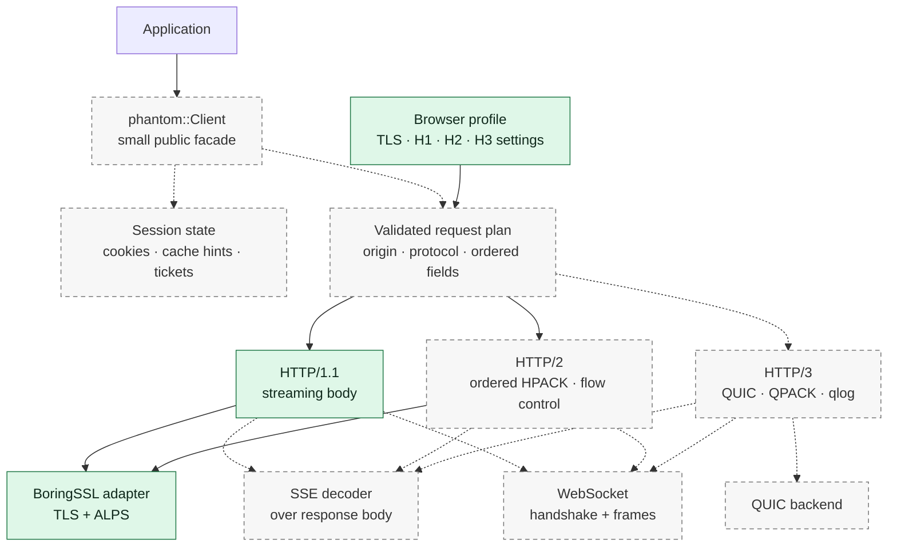
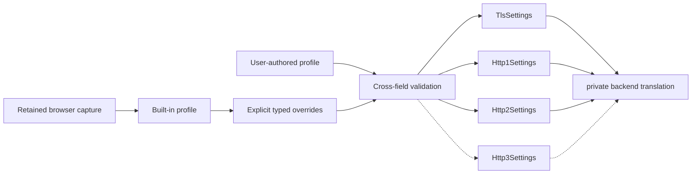
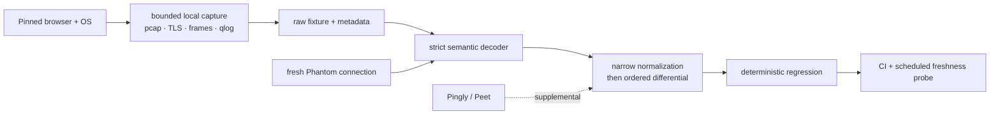

# Architecture

Phantom is a Rust-native client whose observable wire behavior is driven by a
validated browser profile. The project owns the API, profiles, routing, session
behavior, and validation harness. It carries narrow, documented patches to
upstream protocol engines only where their public APIs cannot preserve a
measured browser behavior.

That is the deliberate middle ground between wrapping curl and writing every
protocol from scratch. curl and curl-impersonate remain valuable reference
implementations and comparison targets, but making libcurl the runtime core
would put Rust ownership, asynchronous streaming, H3 diagnostics, and exact
wire controls behind a C compatibility boundary. Reimplementing TLS, HPACK, or
QUIC would add risk without improving Phantom's actual differentiator.

## Runtime shape

Solid boxes exist today. Dashed boxes are planned seams and are not public API
commitments.



SSE is a response-body consumer, not another transport. WebSocket owns its
handshake and frame state machine while reusing the selected HTTP connection.
H3 gets a separate QUIC path because forcing TCP and QUIC through one transport
trait would hide protocol-specific lifecycle, telemetry, and fingerprint
controls.

## Configuration seam

Browser names are metadata, not transport switches. Built-in profiles and user
customization produce the same owned settings types; validation happens before
network I/O.



The settings remain concrete structs and enums. Phantom will add a backend
trait only after a second real implementation proves that interchangeability
is useful. Unsupported combinations fail explicitly; the client never silently
downgrades to a different protocol or fingerprint.

## Workspace ownership

```text
crates/
├── phantom/          # eventual public Client and session facade
├── phantom-profile/  # browser-neutral identity and typed wire settings
├── phantom-net/      # concrete TLS, H1, H2, and later H3 mechanisms
└── phantom-testkit/  # bounded capture and deterministic differential tools

fixtures/             # raw retained browser evidence plus exact metadata
scripts/ci/           # reproducible CI probes and freshness reports
docs/                 # architecture, validation, performance, and roadmap
vendor/               # exact upstream sources plus small reproducible patches
```

Within a crate, modules are named for a protocol or domain responsibility:
`http2/body.rs`, `http2/request.rs`, or `tls/test_support.rs`. There are no
catch-all `common`, `helpers`, or `utils` modules. A file is split when ownership
changes—not when it crosses an arbitrary line count—and backend types stay
private so the public module tree remains shallow.

## Validation loop



The retained bytes are the source evidence. Normalization is limited to values
that must vary, such as random key material, timestamps, packet numbers, and
GREASE values; it must preserve ordering, presence, and negotiated behavior.
Live fingerprint services are useful corroboration, but a matching summary is
not a substitute for a local packet or frame differential.

## Operational seams

- One request operation owns its tracing span, connection driver, body, and
  cancellation path. Dropping a body cannot orphan a task indefinitely.
- Traces record protocol choices, durations, sizes, negotiated state, and error
  classes. They do not record headers, cookies, payloads, or raw ALPS bytes.
- Benchmarks separate profile preparation, handshake, request encoding,
  response streaming, and end-to-end throughput so regressions remain
  attributable.
- Vendored changes carry provenance, a canonical patch, focused regressions,
  and an upstream-candidate probe. Normal dependency and toolchain updates stay
  automated.

## Dependency rules

- Dependencies point from the facade toward profiles and network mechanisms.
- Runtime crates never depend on `phantom-testkit`.
- Profiles never contain mutable session state such as cookies.
- Observable wire ordering uses ordered representations end to end.
- Every public option must be implemented, validated, and observable in a test.
- Security defaults such as certificate and hostname verification remain real
  behavior, not labels or status badges.
