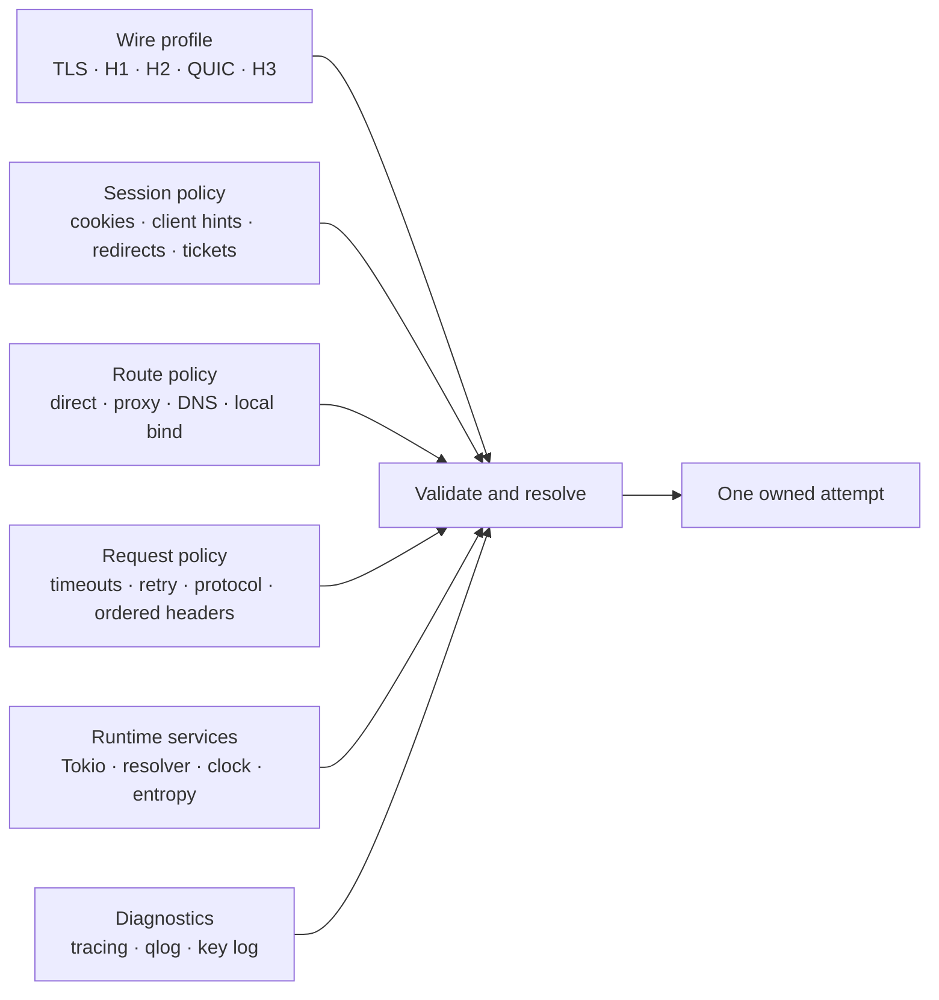

# Configuration model

Phantom exposes behavior by ownership, not as one large builder. A setting is
public only when the implementation can validate it before I/O and an
observable test proves what it changes. Built-in recipes and caller-authored
settings use the same concrete types.

This keeps unrelated lifetimes separate. A TLS cipher list is immutable
profile data. A learned `Accept-CH` value is mutable session state. Proxy
credentials belong to a route. A per-request timeout does not mutate the
client. The runtime owns connection IDs, entropy, clocks, and task execution;
captured profiles describe their policy but never retain captured random
bytes.

## Public shape

The planned facade has three ordinary levels:

- `ClientBuilder` sets long-lived defaults, session stores, route policy,
  runtime services, pool limits, and diagnostics.
- `RequestBuilder` overrides request-scoped behavior such as exact protocol,
  route selection, timeout, retry eligibility, and ordered headers.
- Typed profile values describe observable wire behavior and can be cloned and
  edited before the client is built.

There is no global mutable profile registry, environment-only configuration,
browser-family switch inside a transport, or callback invoked while a pool
key is being computed. Resolved configuration is owned so a live connection
cannot change identity underneath the pool.

Configuration follows these rules:

1. Defaults are useful but never imply browser parity.
2. Exact protocol selection does not fall back.
3. Per-request overrides cannot weaken the route accidentally; proxy failure
   never retries direct.
4. Ordered wire fields remain ordered values rather than maps.
5. Unknown or contradictory settings return a typed error before network I/O.
6. A diagnostic switch cannot alter wire behavior except for the protocol's
   documented diagnostic output, such as qlog or a key log.

## TLS profile and connection policy

A TLS profile is an ordered wire offer, not a security grade. Captured clients
may advertise legacy versions or suites. A connection policy constrains what a
deployment accepts without silently rewriting that offer. Until the public
policy type exists, callers restrict the version range and cipher-suite list
by customizing `TlsSettings` before connector construction.

Profile-policy conflicts will fail before network I/O. This keeps packet
differentials honest and prevents a pool from treating two different wire
identities as equivalent. The complete boundary and threat-review checklist
are documented in [TLS security boundary](tls-security-boundary.md).

## Lessons from adjacent clients

The projects below are references, not APIs to copy wholesale. Their useful
controls fall into distinct ownership domains.

| Project | Useful exposed controls | Phantom decision |
| --- | --- | --- |
| [HttpCloak](https://github.com/sardanioss/httpcloak) | profile selection, exact H1/H2/H3, ECH source, retries, redirects, streaming, auth, ordered headers, sessions, separate TCP/UDP routes, SOCKS and MASQUE | Keep exact protocol and explicit UDP route capability. Split profile, route, session, and request policy rather than one option bag. |
| [hellojs](https://github.com/unreleased/hellojs) | phase timeouts, CONNECT proxy, pooling, retry, early data, verification, lifecycle events, Peet profile import, forced/disabled H3 | Adopt phase-aware deadlines and import tooling only when the retained data can be validated. Early data requires replay policy; verification is never silently disabled by a profile. |
| [`wreq`](https://github.com/0x676e67/wreq) | Tokio/Compio runtimes, encodings, cookies, forms, DNS, SOCKS, stream and WebSocket features; custom executor/timer, protocol and socket tuning, proxy/no-proxy, pools, TLS stores, key logging | Use its separation of compile-time capabilities from runtime policy as a reference. Do not advertise a second runtime until Phantom has a real implementation and test matrix for it. |
| [`tls-client`](https://github.com/bogdanfinn/tls-client) | custom JA3/profile data, header order, protocol racing, session tickets, proxy, H3 switches | Preserve ordered data and explicit racing policy, but make pool/route identity structural and avoid loosely coupled fingerprint strings. |
| [BrowserOxide](https://github.com/yfedoseev/browser_oxide) | shared cookie, session, and learned client-hint state; budgets; proxy and runtime controls | Session state is an explicit owned object. Client hints are not stored in an immutable wire profile. Browser-engine features outside HTTP remain out of scope. |
| [Obscura](https://github.com/h4ckf0r0day/obscura) | browser-level profile, proxy, and operational controls | Reuse lifecycle and isolation lessons, not its browser/CLI surface. |
| [cronet-rs](https://github.com/sleeyax/cronet-rs) | native Cronet callbacks and async adaptation | Keep as a lifecycle caution and comparison target; do not make Cronet Phantom's engine. |
| [Curlium](https://scrapfly.io/curlium) | Rust API around mature protocol engines | Confirms the engine-adapter direction, but public claims alone are not packet evidence. |
| [Prism](https://github.com/WeAreMaven/prism) | passive TCP, TLS, HTTP, and QUIC fingerprints; bounded capture deadlines, concurrency, body, buffer, and drain limits | Use as an independent observation/differential input. Its knobs inform `phantom-testkit`, not the outbound client API, and its summaries do not define parity. |

Controls are added in end-to-end slices. For example, `socks` is not complete
when a URI parser exists: route identity, DNS ownership, authentication,
cancellation, pooling, local fixtures, and failure-without-direct-leakage must
all be proven. The same rule applies to `http3`, `cookies`, `stream`, `sse`,
and `websocket`.

## Custom stacks

Chromium, Firefox, Safari, OkHttp, curl, language runtimes, and private clients
all use the same browser-neutral profile types. Family and platform are
metadata for provenance and selection; they do not select backend code.

A recipe name such as `v152_macos_tls()` states where the evidence was
captured. It does not claim that the represented TLS settings inherently
differ by operating system. Once captures from other supported systems prove
identical component data, they may share one internal value while retaining
their exact provenance. Differences remain separate data, not `cfg(target_os)`
branches in transport code.

The finite typed profile vocabulary is intentional. A new observed field gets
a named meaning, validation, backend capability check, and differential. An
opaque arbitrary-byte escape hatch would make configuration look flexible
while bypassing those guarantees.

Normalization is fixture policy rather than caller configuration. Allowing a
runtime ignore-list would make a differential easy to pass by hiding a new
wire difference. Capture tools may expose resource limits and completion
conditions, but the retained fixture records exactly which nondeterministic
fields its versioned comparison normalizes.
