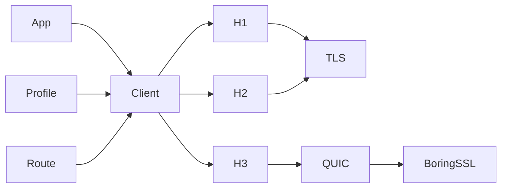

# Design

This document is for maintainers and reviewers. It defines Phantom's stable
ownership and safety boundaries; user configuration belongs in
[Using the client](client.md).

## Principles

1. Wire evidence is the specification.
2. Profiles describe clients; transports consume settings without branching on
   browser-family names.
3. Observable ordering stays ordered through serialization.
4. Unsupported behavior returns an error instead of silently changing
   protocol, route, or fingerprint.
5. Public configuration exists only when it is applied and observable in a
   test.
6. Mutable state has one owner and a finite bound.

## Runtime shape

`phantom` owns request policy and client state. `phantom-profile` owns typed
wire settings. `phantom-net` owns concrete protocol and routing mechanisms.
`phantom-quic-btls` isolates the BoringSSL provider for Quinn.
`phantom-testkit` is test-only capture infrastructure.

Phantom reuses mature protocol engines, with narrow patches only when their
public APIs cannot preserve measured behavior or required failure semantics.

## State and connections

The client owns connections and cross-request state. Pool keys include origin,
route, protocol, and wire-profile identity, preventing reuse across security or
fingerprint boundaries.

H1 admits one exchange and never pipelines. H2 and H3 admit concurrent streams
within local and peer limits. Waiters are bounded, cancellation is
stream-scoped where possible, and draining connections accept no new work.

Cookies, client hints, redirects, TLS sessions, and future DNS or Alt-Svc state
remain client-scoped rather than process-global.

Connection retries are also request-scoped. One finite budget spans every
redirect hop and internal replacement connection. Exact H1, H2, and H3 pools
may consume that budget only around typed connection acquisition, before the
origin request body is polled or request bytes are dispatched. The admission
permit remains held across the delay, but no pool-entry connection lock does.
This keeps bounds and queue order stable while allowing another multiplexed
request to install a compatible generation. Retry never changes the route or
protocol, and negotiated H1/H2 remains excluded until pre-selection admission
has an explicit owner.

## Async and features

Phantom is async-first and targets Tokio. Library code does not create a global
runtime or install a tracing subscriber. A runtime abstraction requires a
second implementation that preserves cancellation, timer, socket, DNS, and
driver-lifecycle behavior.

Optional Cargo features add coherent public capabilities, not backend toggles.

## TLS boundary

A TLS profile is an ordered wire offer, not a security grade. Connection policy
separately decides whether to accept a peer.

By default, Phantom verifies the certificate chain and hostname. Additional
DER roots are additive. HTTPS-proxy trust and origin trust are independent.
The explicit disabled-verification mode is limited to controlled TCP TLS
conformance, cannot be combined with additional roots or HTTP/3, and does not
rewrite the profile.

Profile-policy conflicts fail before I/O. Recoverable input and network
failures return typed errors; runtime library code must not panic.

## Protocol boundaries

- H1 and H2 share TCP/TLS construction but retain protocol-specific lifecycle
  and serialization.
- H3 has a separate QUIC path because its transport, diagnostics, and
  fingerprint controls differ materially.
- The H3 QUIC socket is either direct UDP or Phantom's local-/remote-DNS
  SOCKS5 UDP ASSOCIATE adapter. The remote-DNS adapter keeps the wire target as
  a domain while presenting one stable logical peer to Quinn. All paths
  preserve the route selected before setup; proxy or QUIC failure cannot select
  a different route or protocol.
- Every transport returns the standard `http::Response` view plus ordered
  response fields.
- A streaming request body declares its complete ordered trailer-name plan
  before I/O. The common body boundary validates the terminal semantic map and
  reconstructs ordered values; each transport validates and emits its own wire
  representation without permitting static/dynamic ambiguity or replay.
- Routing resolves before connection setup and is part of pool identity.
- Setup retries remain inside exact-protocol pools and cannot absorb TLS,
  proxy negotiation, response, or post-dispatch failures.
- SSE and WebSocket reuse client contracts without hiding their distinct
  lifecycles.

Forward-proxy Basic authentication is request-scoped rather than learned
client state. Every logical exact-H1 forwarding request starts anonymously. A
strict, valid Basic `407` challenge permits one replay on a fresh connection
with the same complete route; a second `407` or an unusable challenge is a
typed proxy failure. The generated sensitive credential field follows caller
fields and precedes generated framing. Owned bodies and static trailers remain
replayable, while a one-shot streaming body fails before a retry connection is
opened. This lifecycle never changes the selected protocol or route and never
falls back direct.

## Dependency policy

A vendored change must name its upstream revision, explain the missing seam,
carry a reproducible patch, preserve stock defaults, and include focused tests.
`scripts/ci/check-vendor.sh` verifies each patched package.

Backend types remain private, and runtime crates never depend on the testkit.
See [HTTP/3 internals](http3.md) for its specialized boundaries.
