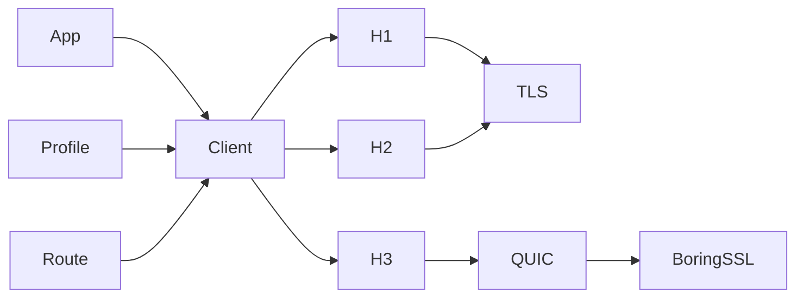

# Design

This document is for maintainers, reviewers, and users who want to know why
Phantom behaves as it does. It defines Phantom's stable ownership and safety
boundaries; user configuration belongs in
[Using the client](../guides/client.md).

## Principles

1. Wire evidence is the specification.
2. Profiles describe clients; transports consume settings without branching on
   browser-family names.
3. Observable ordering stays ordered through serialization.
4. Unsupported behavior returns an error instead of silently changing
   protocol, route, or fingerprint.
5. Public configuration exists only when it is applied and observable in a
   test.
6. Mutable state has one owner and a finite bound.

## Runtime shape

`phantom` owns request policy and client state. `phantom-profile` owns typed
wire settings. `phantom-net` owns concrete protocol and routing mechanisms.
`phantom-quic-btls` isolates the BoringSSL provider for Quinn.
`phantom-testkit` is test-only capture infrastructure.

Phantom reuses mature protocol engines, with narrow patches only when their
public APIs cannot preserve measured behavior or required failure semantics.

## State and connections

The client owns connections and cross-request state. Pool keys include origin,
route, protocol, and wire-profile identity, preventing reuse across security or
fingerprint boundaries.

H1 admits one exchange and never pipelines. H2 and H3 admit concurrent streams
within local and peer limits. Waiters are bounded, cancellation is
stream-scoped where possible, and draining connections accept no new work.

Cookies, client hints, Alt-Svc advertisements, redirects, TLS sessions, and
future DNS state remain client-scoped rather than process-global.

Connection retries are also request-scoped. One finite budget spans every
redirect hop and internal replacement connection. Exact H1, H2, and H3 pools
may consume that budget only around typed connection acquisition, before the
origin request body is polled or request bytes are dispatched. The negotiated
H1/H2 pool may consume it only for a TCP connect failure before TLS, so ALPN
has not selected a protocol; TLS and ALPN failures stay terminal. A negotiated
request first takes a bounded pre-selection admission, sized by the larger H1
or H2 active and waiting limits, and converts it to the selected protocol's
admission after ALPN. The admission permit remains held across the delay, but
no pool-entry connection lock does. This keeps bounds and queue order stable
while allowing another request to install a compatible generation. Retry
never changes the route, the exact protocol, or the negotiated selection rule.
The one graceful-`GOAWAY` replay of a bodyless H2 GET follows the same rule:
exact H2 keeps its admission for the replacement, while a negotiated request
releases its H2 admission and re-enters pre-selection admission and ALPN.

Replaying bytes that may have reached the origin is a separate, opt-in class.
The H1 transport reports a reused keep-alive connection that closed or reset
before any response byte as its own typed error; a fresh connection or a
partial response keeps the ordinary protocol error. The facade replays only an
idempotent method whose body is absent or owned bytes, once per hop, on a
fresh connection with the same route, and outside the setup-retry budget. The
evidence is Chrome's single restart after `ERR_CONNECTION_CLOSED` on a reused
socket. Firefox also restarts on fresh connections, which Phantom does not.

Unprocessed-request replay is caller policy on `RetryPolicy`, never a profile
default. It trusts only peer signals that a request was not processed:
`REFUSED_STREAM`, an H2 `GOAWAY` whose last-stream-id is below the stream,
`H3_REQUEST_REJECTED`, and an H3 `GOAWAY` that arrived before the stream
opened. The H2 transport exposes whether a reset or `GOAWAY` came from the
peer, and the vendored H2 engine fails a request with a remote `GOAWAY` only
for streams above the last-stream-id or refused before opening; processed
streams end with a transport error when the connection closes. The H3
transport tags only failures seen before a response head. Because nothing was
processed, any method may repeat, but only with an absent or owned body. One
request-scoped budget spans redirects, separate from every other retry class.
The replay adds no delay and never changes route, protocol, selection rule, or
Alt-Svc alternative; the pool retires the refusing connection so the replay
uses another one.

Status retry is caller policy, not browser behavior, so it lives on
`RetryPolicy` and never in a profile. It runs per hop after proxy
authentication and Critical-CH handling, so an intermediate response has
already updated cookies, client hints, and Alt-Svc. Only idempotent methods
with absent or owned bodies repeat, and only for 408, 425, 429, 500, 502,
503, or 504; 421 is rejected at configuration because repeating it on the
same target cannot succeed. One request-scoped budget spans redirects,
separate from the setup-retry budget. A delay that cannot finish before the
total deadline, or an honored `Retry-After` above the caller's cap, returns
the response rather than waiting, so a usable response never becomes a
timeout. The intermediate body is dropped unread instead of
drained, so an unbounded body cannot stall the retry. The route, protocol,
and any Alt-Svc alternative in use never change.

## Async and features

Phantom is async-first and targets Tokio. Library code does not create a global
runtime or install a tracing subscriber. A runtime abstraction requires a
second implementation that preserves cancellation, timer, socket, DNS, and
driver-lifecycle behavior.

Optional Cargo features add coherent public capabilities, not backend toggles.

## TLS boundary

A TLS profile is an ordered wire offer, not a security grade. Connection policy
separately decides whether to accept a peer.

By default, Phantom verifies the certificate chain and hostname. Additional
DER roots are additive. HTTPS-proxy trust and origin trust are independent.
The explicit disabled-verification mode is limited to controlled TCP TLS
conformance, cannot be combined with additional roots or HTTP/3, and does not
rewrite the profile.

Profile-policy conflicts fail before I/O. Recoverable input and network
failures return typed errors; runtime library code must not panic.

## Protocol boundaries

- H1 and H2 share TCP/TLS construction but retain protocol-specific lifecycle
  and serialization.
- H3 has a separate QUIC path because its transport, diagnostics, and
  fingerprint controls differ materially.
- The H3 QUIC socket is either direct UDP or Phantom's local-/remote-DNS
  SOCKS5 UDP ASSOCIATE adapter. The remote-DNS adapter keeps the wire target as
  a domain while presenting one stable logical peer to Quinn. All paths
  preserve the route selected before setup; proxy or QUIC failure cannot select
  a different route or protocol.
- An Alt-Svc upgrade changes only the H3 transport location. Pool identity,
  request authority, TLS authentication name, cookies, client hints, and
  request policy remain attached to the original HTTPS origin. A different
  transport location cannot reuse the previous H3 connection generation.
  Sequential use is the default; opt-in racing chooses between exactly two
  pre-declared candidates (alternative QUIC, then delayed origin H1/H2) on the
  same route and sends the request once, on the winner. A losing alternative
  that fails is marked broken with bounded doubling backoff instead of being
  evicted, as Chromium does.
- Every transport returns the standard `http::Response` view plus ordered
  response fields.
- Response content decoding is an opt-in facade body stage above every
  transport. It is gated by the caller's own `Accept-Encoding`, never edits
  request fields, and keeps response fields as the wire view.
- A streaming request body declares its complete ordered trailer-name plan
  before I/O. The common body boundary validates the terminal semantic map and
  reconstructs ordered values; each transport validates and emits its own wire
  representation without permitting static/dynamic ambiguity or replay.
- Routing resolves before connection setup and is part of pool identity.
- Setup retries remain inside exact-protocol pools and the negotiated pool's
  pre-TLS connect step, and cannot absorb TLS, ALPN, proxy negotiation,
  response, or post-dispatch failures.
- SSE and WebSocket reuse client contracts without hiding their distinct
  lifecycles. An exact-protocol H2 WebSocket uses a dedicated
  extended-CONNECT connection. A profile `WebSocketConnectionPolicy` instead
  places the WebSocket on a pooled H2 session to the same origin and route
  when its peer enabled extended CONNECT, and otherwise opens the connection
  the profile names: an HTTP/1.1 Upgrade on TLS with the policy's own ALPN
  offer, or a new H2 connection. The facade reads that data and never
  branches on client family. A per-request HEADERS override in the vendored
  H2 engine gives the CONNECT stream the profile's pseudo-header order and
  priority, so ordinary streams on the session keep theirs; HPACK state stays
  connection-wide. The choice is made once before WebSocket bytes are sent,
  and a failure on the chosen connection never falls back to another
  connection or protocol. The accepted stream retains both DATA directions
  and the connection driver.

Forward-proxy Basic authentication is request-scoped rather than learned
client state. Every logical exact-H1 forwarding request starts anonymously. A
strict, valid Basic `407` challenge permits one replay on a fresh connection
with the same complete route; a second `407` or an unusable challenge is a
typed proxy failure. The generated sensitive credential field follows caller
fields and precedes generated framing. Owned bodies and static trailers remain
replayable, while a one-shot streaming body fails before a retry connection is
opened. This lifecycle never changes the selected protocol or route and never
falls back direct.

## Dependency policy

A vendored change must name its upstream revision, explain the missing seam,
carry a reproducible patch, preserve stock defaults, and include focused tests.
`scripts/ci/check-vendor.sh` verifies each patched package.

Backend types remain private, and runtime crates never depend on the testkit.
See [HTTP/3 internals](../internals/http3.md) for its specialized boundaries.

## Unsafe code

The workspace forbids `unsafe_code`. The single exception is
`phantom-quic-btls`, the audited FFI crate that drives BoringSSL's QUIC TLS
API for Quinn. It overrides the workspace lint with `unsafe_code = "deny"`
and `unsafe_op_in_unsafe_fn = "deny"`, and allows unsafe code only in its
private `backend` module, the complete FFI boundary. Every unsafe block there
must carry a `SAFETY` comment (`clippy::undocumented_unsafe_blocks` is
denied). No raw pointer or `btls-sys` item crosses the crate's public API;
callers supply only the safe `btls` `SslContext` wrapper.
Safe protocol code in the crate cannot add unsafe operations without moving
them into `backend`, where review concentrates. Changes to that module need
the same scrutiny as a vendored patch: a stated invariant for every unsafe
block and tests that exercise the failure paths. The macOS and Windows CI
jobs also run the crate's unit tests in release mode to check the native
link.
