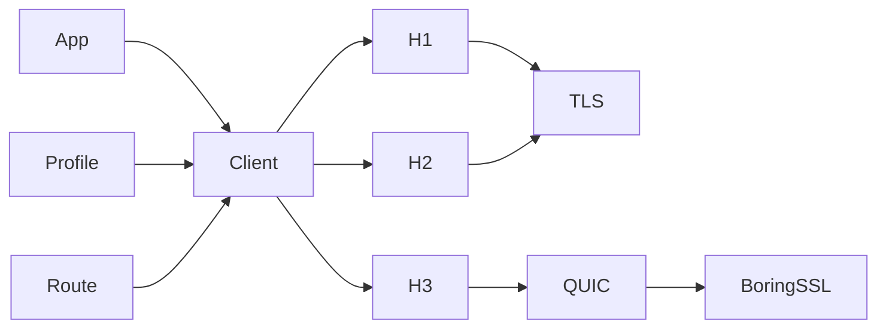

# Design

Phantom aims to send what a recorded browser sends and to fail visibly when it
cannot. This page explains the principles behind that aim and the ownership
and safety boundaries that follow from them. It is for reviewers,
maintainers, and users who want to know why Phantom behaves as it does. For
configuration, see [Using the client](../guides/client.md). For the evidence
behind each claim, see [Validation](validation.md).

## Principles

1. **Recorded browser behavior is the specification.** The target is what a
   real browser sends, as captured on the wire, rather than everything a
   standard permits. When a capture cannot show a behavior, such as a TCP
   socket option, the browser's source code at the profiled release is the
   evidence.
2. **Profiles describe clients; transports apply settings.** Browser identity
   lives only in profile data. Transport code applies whatever settings a
   profile holds and never branches on a browser family, so a new browser
   needs a new profile rather than new transport code.
3. **Order that is visible on the wire stays in order.** When a peer can see
   the order of fields, settings, or extensions, no layer sorts, hashes, or
   regroups them.
4. **Unsupported behavior is an error.** Phantom never silently changes
   protocol, route, or fingerprint to complete a request. A silent change
   would send traffic the caller did not choose, so Phantom returns an error
   instead.
5. **A setting is public only when it is applied and tested.** Every public
   option changes what Phantom does, and a test observes the change.
6. **Mutable state has one owner and a finite bound.** Caches, pools, and
   queues belong to a client rather than the process, and each has a limit.

## Runtime shape

| Crate | Owns |
| --- | --- |
| `phantom-http` (library `phantom`) | Request policy and client state |
| `phantom-profile` | Typed wire settings |
| `phantom-net` | Concrete protocol and routing mechanisms |
| `phantom-quic-btls` | The BoringSSL provider for Quinn, isolated |
| `phantom-testkit` | Test-only capture infrastructure |

Phantom reuses mature protocol engines. It patches them narrowly, and only
when their public APIs cannot preserve measured behavior or the required
failure semantics.

## State and connections

The client owns every connection and all cross-request state. Cookies, client
hints, Alt-Svc advertisements, redirects, TLS sessions, and future DNS state
belong to one client, never to the process.

Pool keys include origin, route, protocol, and wire-profile identity, so a
connection is never reused across a security or fingerprint boundary.

HTTP/1.1 (H1) runs one exchange at a time on a connection and never
pipelines. HTTP/2 (H2) and HTTP/3 (H3) run concurrent streams within local and
peer limits. Waiters are bounded, cancellation is scoped to a stream where
possible, and a draining connection accepts no new work.

## Retries and replays

A retry can change what a server sees, so every retry class is bounded and
none changes the route, the exact protocol, the negotiated selection rule, or
the Alt-Svc alternative in use. The [retries guide](../guides/retries.md)
covers configuration. This section records the boundaries each class keeps.

### Connection-setup retries

Setup retries are request-scoped. One finite budget spans every redirect hop
and every internal replacement connection.

- Exact H1, H2, and H3 pools may spend the budget only around typed connection
  acquisition, before the origin request body is polled or any request byte is
  dispatched.
- The negotiated H1/H2 pool may spend it only on a TCP connect failure before
  TLS starts, when ALPN (Application-Layer Protocol Negotiation) has not yet
  selected a protocol. TLS and ALPN failures are terminal.

Setup retries therefore stay inside exact-protocol pools and the negotiated
pool's pre-TLS connect step. They cannot absorb TLS, ALPN, proxy negotiation,
response, or post-dispatch failures.

A negotiated request first takes a bounded pre-selection admission, sized by
the larger of the H1 and H2 active and waiting limits. After ALPN, that
admission converts to the selected protocol's admission. The request holds
its admission permit across the retry delay but holds no pool-entry
connection lock. Bounds and queue order therefore stay stable, and another
request can install a compatible connection generation in the meantime.

H2 has one built-in graceful-`GOAWAY` replay for a bodyless GET, and it keeps
the same boundary. An exact H2 request keeps its admission for the
replacement connection. A negotiated request releases its H2 admission and
goes through pre-selection admission and ALPN again.

### Reused-connection replay

Replaying bytes that may have reached the origin is a separate class, and it
is opt-in. The H1 transport reports a reused keep-alive connection that closed
or reset before any response byte as its own typed error. A fresh connection,
or a failure after part of a response, keeps the ordinary protocol error.

The facade replays only an idempotent method whose body is absent or owned
bytes. It replays once per hop, on a fresh connection with the same route,
outside the setup-retry budget. The evidence is Chrome's single restart after
`ERR_CONNECTION_CLOSED` on a reused socket. Firefox also restarts requests on
fresh connections; Phantom does not.

### Unprocessed-request replay

Unprocessed-request replay is caller policy on `RetryPolicy`, never a profile
default. It trusts only peer signals that a request was not processed:

- `REFUSED_STREAM`;
- an H2 `GOAWAY` whose last-stream-id is below the request's stream;
- `H3_REQUEST_REJECTED`; and
- an H3 `GOAWAY` that arrived before the stream opened.

The H2 transport reports whether a reset or `GOAWAY` came from the peer. The
vendored H2 engine fails a request with a remote `GOAWAY` only for streams
above the last-stream-id or refused before opening; a processed stream ends
with a transport error when the connection closes. The H3 transport tags only
failures seen before a response head.

Because the peer processed nothing, any method may repeat, but only with an
absent or owned body. One request-scoped budget spans redirects and is
separate from every other retry class. The replay adds no delay, and the pool
retires the refusing connection so the replay uses another one.

### Status retry

Status retry is caller policy, not browser behavior, so it lives on
`RetryPolicy` and never in a profile. It runs per hop, after proxy
authentication and Critical-CH handling, so an intermediate response has
already updated cookies, client hints, and Alt-Svc.

Only idempotent methods with absent or owned bodies repeat, and only for 408,
425, 429, 500, 502, 503, or 504. Configuration rejects 421, because repeating
it on the same target cannot succeed. One request-scoped budget spans
redirects and is separate from the setup-retry budget.

A usable response never turns into a timeout. If a delay cannot finish before
the total deadline, or an honored `Retry-After` exceeds the caller's cap,
Phantom returns the response instead of waiting. The intermediate body is
dropped unread rather than drained, so an unbounded body cannot stall the
retry.

## Async and features

Phantom is async-first and targets Tokio. Library code does not create a
global runtime or install a tracing subscriber. Supporting another runtime
would need a second implementation that preserves cancellation, timer,
socket, DNS, and driver-lifecycle behavior.

Each optional Cargo feature adds a coherent public capability. Features are
not backend toggles.

## TLS boundary

A TLS profile is an ordered wire offer, not a security grade. Connection
policy decides separately whether to accept a peer.

By default, Phantom verifies the certificate chain and hostname. Additional
DER roots add to the bundled roots rather than replacing them. HTTPS-proxy
trust and origin trust are configured independently.

`ServerAuthentication::Disabled` turns verification off explicitly, for
controlled TLS conformance testing over TCP. It applies only to H1 and H2,
cannot be combined with additional roots or HTTP/3, and does not change the
profile's ClientHello.

Conflicts between a profile and connection policy fail before any I/O.
Recoverable input and network failures return typed errors; runtime library
code must not panic.

## Protocol boundaries

- H1 and H2 share TCP and TLS construction but keep their own lifecycle and
  serialization.
- H3 has a separate QUIC path, because its transport, diagnostics, and
  fingerprint controls differ materially.
- The H3 QUIC socket is either direct UDP or Phantom's SOCKS5 UDP ASSOCIATE
  adapter, with local or remote DNS. The remote-DNS adapter keeps the wire
  target as a domain name while presenting one stable logical peer to Quinn.
  Every path keeps the route selected before setup; a proxy or QUIC failure
  cannot select a different route or protocol.
- An Alt-Svc upgrade changes only where the H3 transport connects. Pool
  identity, request authority, the TLS authentication name, cookies, client
  hints, and request policy stay attached to the original HTTPS origin. A
  different transport location cannot reuse the previous H3 connection
  generation.
- Alt-Svc use is sequential by default. Opt-in racing chooses between exactly
  two pre-declared candidates on the same route, the alternative QUIC
  connection and then, after a delay, the origin H1/H2 connection, and sends
  the request once, on the winner. A losing alternative that fails is marked
  broken with a bounded doubling backoff instead of being evicted, as
  Chromium does.
- Every transport returns the standard `http::Response` view plus the
  response fields in wire order.
- Response content decoding is an opt-in facade body stage above every
  transport. It is gated by the caller's own `Accept-Encoding`, never edits
  request fields, and keeps the response fields as the wire view.
- A streaming request body declares its complete, ordered plan of trailer
  names before I/O. The shared body boundary validates the final semantic map
  and rebuilds the ordered values. Each transport then validates and emits its
  own wire representation, with no ambiguity between static and dynamic
  trailers and no replay.
- Routing resolves before connection setup and is part of pool identity.

### WebSocket and SSE

Server-sent events (SSE) and WebSocket reuse the client's contracts without
hiding their distinct lifecycles.

An exact-protocol H2 WebSocket uses a dedicated extended-CONNECT connection. A
profile `WebSocketConnectionPolicy` instead places the WebSocket on a pooled
H2 session to the same origin and route when that session's peer enabled
extended CONNECT. Otherwise it opens the connection the profile names: either
an HTTP/1.1 Upgrade over TLS with the policy's own ALPN offer, or a new H2
connection. The facade reads that choice from profile data and never branches
on client family.

A per-request HEADERS override in the vendored H2 engine gives the CONNECT
stream the profile's pseudo-header order and priority, so ordinary streams on
the same session keep theirs. HPACK state stays connection-wide.

The connection choice is made once, before any WebSocket bytes are sent. A
failure on the chosen connection never falls back to another connection or
protocol. The accepted stream keeps both DATA directions and the connection
driver.

### Forward-proxy authentication

Forward-proxy Basic authentication is request-scoped; the client learns no
state from it. Every logical exact-H1 forwarding request starts without
credentials. A strict, valid Basic `407` challenge permits one replay on a
fresh connection with the same complete route. A second `407`, or a challenge
Phantom cannot use, is a typed proxy failure.

The generated `Proxy-Authorization` field is marked sensitive and placed after
the caller's fields and before generated framing. Owned bodies and static
trailers can be replayed; a one-shot streaming body fails before Phantom opens
a retry connection. This lifecycle never changes the selected protocol or
route, and never falls back to a direct connection.

## Dependency policy

A change to a vendored dependency must name its upstream revision, explain
the missing seam, carry a reproducible patch, preserve stock defaults, and
include focused tests. `scripts/ci/check-vendor.sh` verifies each patched
package; [Vendoring](../internals/vendoring.md) describes the workflow.

Backend types stay private, and runtime crates never depend on the testkit.
See [HTTP/3 internals](../internals/http3.md) for the boundaries specific to
H3.

## Unsafe code

The workspace forbids `unsafe_code`. The single exception is
`phantom-quic-btls`, the audited FFI crate that drives BoringSSL's QUIC TLS
API for Quinn.

- The crate overrides the workspace lint with `unsafe_code = "deny"` and
  `unsafe_op_in_unsafe_fn = "deny"`, and allows unsafe code only in its
  private `backend` module, which is the complete FFI boundary.
- Every unsafe block there carries a `SAFETY` comment;
  `clippy::undocumented_unsafe_blocks` is denied.
- No raw pointer or `btls-sys` item crosses the crate's public API. Callers
  supply only the safe `btls` `SslContext` wrapper.

Safe protocol code in the crate cannot add unsafe operations without moving
them into `backend`, where review concentrates. A change to that module needs
the same scrutiny as a vendored patch: a stated invariant for every unsafe
block, and tests that exercise the failure paths. The macOS and Windows CI
jobs also run the crate's unit tests in release mode to check the native
link.
