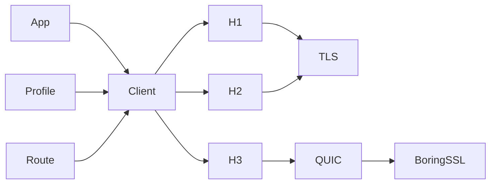

# Design

Read why Phantom keeps browser settings, connection state, and request policy
separate. These choices determine what you can change and how failures reach
your code.

## Principles

1. [Recorded browser behavior is the specification.](#recorded-browser-behavior-is-the-specification)
2. [No silent fallback.](#no-silent-fallback)
3. [Order is part of the fingerprint.](#order-is-part-of-the-fingerprint)
4. [Profiles hold identity; transports apply settings.](#profiles-hold-identity-transports-apply-settings)
5. [A setting is public only when it is applied and tested.](#a-setting-is-public-only-when-it-is-applied-and-tested)
6. [State belongs to one client and has a bound.](#state-belongs-to-one-client-and-has-a-bound)
7. [Retries never change what the server sees.](#retries-and-replays)
8. [The safety boundary stays narrow.](#safety-boundary)

[How the pieces fit](#how-the-pieces-fit) then describes the crates and
protocol boundaries that carry these rules.

## Recorded browser behavior is the specification

Recipes describe the traffic a browser sends, including choices the standards
leave open. For example, a connection to an HTTPS proxy keeps the profile's
ALPN list, the protocols it offers during TLS. Changing that list would change
the handshake the proxy sees.

Named recipes leave WebSocket over HTTP/3 off because browsers do not open it
by default. You can use `Client::websocket_with_protocol` with
`HttpProtocol::Http3` for a server that supports RFC 9220. Your profile must
set an extended CONNECT pseudo-header order. No named recipe sets one, and
profile policy never chooses HTTP/3. The opening uses Phantom's default
headers.

Phantom carries one version per browser. Desktop recipes include Windows and
macOS settings, and separate recipes cover Android. Edge uses the Chromium TCP
settings. A new browser version needs its own validation before it gets a
recipe.

## No silent fallback

An exact H3 request fails when UDP is blocked. You can opt into
`RetryPolicy::with_http2_fallback`, and the response reports the protocol that
answered. Otherwise, the request keeps its protocol and route. A conflict
between your profile and connection policy fails before network I/O.

A silent change sends traffic the caller did not choose. An HTTP/3 request
that quietly retries over HTTP/2 presents a different fingerprint, and a
proxied request that quietly goes direct leaves from a different address.
Either change can matter more to the caller than the failed request.

Some requests therefore fail where a general-purpose client would succeed. A
negotiated request through a CONNECT-UDP proxy is refused before any proxy
I/O. An exact H2 WebSocket to a peer that did not enable extended
CONNECT fails and does not drop to HTTP/1.1. To try another protocol or route,
catch the error and send a new request that names it.

## Order is part of the fingerprint

Request headers keep the order you supply, or the order of your [request
template](../reference/glossary.md#request-template). Every transport also
returns response headers in wire order alongside the standard `http::Response`
view. Settings and extensions keep the profile's order rules. See [Header
order](../fingerprinting.md#header-order) for why those rules matter.

You choose the field order, either directly or through a template. Phantom
builds on BoringSSL (through `btls`), the `http2` fork of h2, Quinn, `h3`, and
`tungstenite`, and patches each narrowly where its public API cannot preserve
measured behavior or the required failure semantics. Your build depends on
those patched forks, and another crate in it cannot replace them (see
[Adding Phantom to a project](../guides/downstream.md)). The `http2` fork,
for example, lets a profile state the HPACK encoder choices that RFC 7541
leaves open, which upstream h2 decides itself.

## Profiles hold identity; transports apply settings

You build a `ClientProfile` from recipes, one layer at a time. The profile
holds browser identity. Transport code applies those settings without
branching on the browser name. Host-specific code handles sockets, trust
stores, native builds, and profiling.

Each protocol keeps one connection lifecycle for all profiles. This keeps
browser settings visible in profile data rather than hidden in transport
branches.

You can combine a Chrome TLS recipe with a Firefox H2 recipe, but that
combination matches no browser. A template does not compare your `User-Agent`
or `sec-ch-ua` with its browser. It checks required caller slots instead, so
an Edge template without `User-Agent` fails.

## A setting is public only when it is applied and tested

Every public option must change what Phantom does, with a test that observes
the change. For example, `TlsSettings::session_ticket_order` chooses which
saved TCP ticket a connection offers. `session_tickets_per_origin` bounds how
many it keeps. An option that only parses would misdescribe your traffic.

## State belongs to one client and has a bound

The client owns every connection and all cross-request state. Cookies, client
hints, Alt-Svc advertisements, redirects, TLS sessions, and HTTPS DNS record
results belong to one client, never to the process. Shared process state would let
what one client learned change what another sends, such as a session ticket
resumed under a different profile.

Caches, pools, and queues each have a limit. Full stores evict entries under
their own rules, while full queues reject new waiters. The defaults are in
[Defaults and limits](../reference/limits.md). Clones share client state.
Separately built clients make their own handshakes and relearn hints and
alternatives.

Pool keys include origin, route, protocol, and wire-profile identity, so a
connection is never reused across a security or fingerprint boundary.

HTTP/1.1 (H1) runs one exchange at a time on a connection and never
pipelines. HTTP/2 (H2) and HTTP/3 (H3) run concurrent streams within local and
peer limits. Waiters are bounded, cancellation is scoped to a stream where
possible, and a draining connection accepts no new work.

The H1 bound counts idle connections and connections still in setup. Admission
uses the same bound, so a request without an idle connection has room to open
one. Each runtime has its own pool and bound. Using one client across several
runtimes can therefore exceed Firefox's per-origin count.

`TcpBackupConnection` makes one exception for the slower attempt, which has
carried no request. Once it connects, it counts toward the key's bound but is
kept even when the bound is full. Each slower attempt still in flight can add
one extra connection, up to the bound again. Those extra connections stay
until used or expired. A request takes an idle connection instead of opening
another.

One client timer closes expired idle H1 connections in both H1 pools. It also
clears each pool's remembered state for an origin with no connection.
Firefox's connection manager uses one pruning timer too.

## Retries and replays

Sending a request twice can cause its effects twice. Each retry class
therefore has a bound. Retries keep the route, negotiated protocol rule, and
Alt-Svc alternative.

The opt-in HTTP/2 fallback applies only before a QUIC connection has carried
the HTTP/3 request. Most retries need your configuration. Built-in exceptions
include one H2 `GOAWAY` replay and Chromium's resend after a failed H2 PING.
Firefox's restarts on fresh connections are not modeled.

The [retries guide](../guides/retries.md) covers configuration. The sections
below record the boundaries each class keeps.

### Connection-setup retries

Setup retries are request-scoped. One finite budget spans every redirect hop
and every internal replacement connection.

- Exact H1, H2, and H3 pools may spend the budget only around typed connection
  acquisition, before the origin request body is polled or any request byte is
  dispatched.
- The negotiated H1/H2 pool may spend it only on a TCP connect failure before
  TLS starts, when [ALPN](../reference/glossary.md#alpn) has not yet selected a
  protocol. TLS and ALPN failures are terminal.

Setup retries therefore stay inside exact-protocol pools and the negotiated
pool's pre-TLS connect step. They cannot absorb TLS, ALPN, proxy negotiation,
response, or post-dispatch failures.

A negotiated request takes admission before the server selects H1 or H2. The
limit is the larger of the protocols' active and waiting limits. Opening a
connection or using an idle H1 connection also takes an H1 connection slot.

Before any connection has selected H1, all slots may be in handshakes. A
request then waits for a handshake rather than queues for a slot. An H2 result
can serve it without an H1 slot. After ALPN, admission transfers to the
selected protocol.

The request keeps its pre-selection permit across a retry delay. It returns
the connection slot and holds no lock. Other requests can open a connection or
install an H2 connection during that delay. Admission limits and queue order
stay the same.

H2 has one built-in replay for a bodyless GET without trailers after a
`GOAWAY(NO_ERROR)`. It keeps the same boundary. An exact H2 request keeps its
admission for the replacement connection. A negotiated request releases its H2
admission and goes through pre-selection admission and ALPN again.

### Reused-connection replay

Replaying bytes that may have reached the origin is a separate class. You opt
in, apart from the PING-failure resend below. H1 reports a reused connection
that closed or reset before any response byte as its own typed error. A fresh
connection, or a failure after part of a response, keeps the ordinary protocol
error.

The client replays only an idempotent method with an absent, owned, or
buffered body. A buffered body must stay within its retention limit and have
no source failure. It replays once per hop, on a fresh connection with the same route,
outside the setup-retry budget. This follows Chrome's single restart after
`ERR_CONNECTION_CLOSED` on a reused socket. Firefox's restarts on fresh
connections are not modeled.

### Unprocessed-request replay

Unprocessed-request replay is caller policy on `RetryPolicy`, never a profile
default. It trusts only peer signals that a request was not processed:

- `REFUSED_STREAM`;
- an H2 `GOAWAY` whose last-stream-id is below the request's stream;
- `H3_REQUEST_REJECTED`; and
- an H3 `GOAWAY` that arrived before the stream opened.

The H2 transport reports whether a reset or `GOAWAY` came from the peer. The
vendored H2 engine fails a request with a remote `GOAWAY` only for streams
above the last-stream-id or refused before opening. A processed stream ends
with a transport error when the connection closes. The H3 transport tags only
failures seen before a response head.

Because the peer processed nothing, any method may repeat, but only with an
absent or owned body. One request-scoped budget spans redirects and is
separate from every other retry class. The replay adds no delay, and the pool
retires the refusing connection so the replay uses another one.

### PING-failure resend

The Chromium recipes resend a request whose H2 connection closed itself after
an unanswered PING before the request's response head, as Chrome resends after
`ERR_HTTP2_PING_FAILED`. The profile owns it
(`Http2Settings::ping_failure_retries`), not `RetryPolicy`, because it is
browser behavior: any method may repeat, with an absent or owned body, up to
the profile's count per redirect hop, apart from every policy budget. The
server may have processed the request, which is why Firefox's recipe sets 0.
The pool retires the connection before the request fails, so the resend
takes another one at once.

### Status retry

Status retry is caller policy, so it lives on `RetryPolicy` and never in a
profile. It runs per hop, after proxy
authentication and Critical-CH handling, so an intermediate response has
already updated cookies, client hints, and Alt-Svc.

Only idempotent methods with absent or owned bodies repeat, and only for 408,
425, 429, 500, 502, 503, or 504. Each of these reports a condition that a
later identical request can clear. Configuration rejects 421, because
repeating it on the same route and connection target cannot succeed. One
request-scoped budget spans redirects and is separate from the setup-retry
budget.

A usable response never turns into a timeout. If a delay cannot finish before
the total deadline, or an honored `Retry-After` exceeds the caller's cap,
Phantom returns the response instead of waiting. The intermediate body is
dropped unread, so an unbounded body cannot stall the retry.

### Fields of a repeated attempt

A negotiated request builds its HTTP/1.1 and HTTP/2 field lists once per
redirect hop and checks them before any I/O. A request that races Alt-Svc
alternatives builds and checks one HTTP/3 list per raced alternative at the
same time, each with its own `Alt-Used` if the profile sends one. Each list
takes the template, your fields, the cookie jar's value, and the client hints
known at that moment: the profile's defaults and those the origin requested
through `Accept-CH`. A hint that another response teaches later reaches the
next request, not this one.

The race's winner sends its lists as they were built. So does every attempt of
the request that repeats one no response answered: a graceful `GOAWAY` retry,
a restart after rejected early data, a reused-connection replay, an
unprocessed-request replay, a PING-failure resend, and a race started again
after an early-data handshake failed. A cookie that another request stores in
the meantime is sent from the next request on.

A `Critical-CH` retry and a status retry follow a response, which may have
stored cookies or requested client hints, so they build and check the lists
again. Each redirect hop builds its own for its URL, method, body, and
fields. An exact request builds its one list again for a reused-connection
replay, an unprocessed-request replay, and a PING-failure resend as well.

ALPS `ACCEPT_CH` cannot edit headers already built. For a page load, or a
request without a template, it can stop the request before any bytes are
written. This happens when the entry names a hint the request lacks.

The connection stays pooled. The request rebuilds its headers with the hint,
reading cookies and stored hints again. It then takes a connection, usually
the same one. The entry does not update the origin's stored hint set.
Templates that disable this restart, such as `fetch` templates, send the
headers already built.

The Chromium navigation templates put restart hints after `Accept`. Hints
added by a restart use that slot for the rest of the hop. Hints learned before
the request was built keep the template's ordinary hint block. A request
without a template puts restart hints after every other header.

A restart writes nothing, so any method and any body may restart, a streaming
body included. The hints a request restarted for stay for the rest of its hop,
so it restarts at most once per hint the profile sends on request. Chromium's
own bound of 20 restarts per navigation is out of reach of every named recipe.
A request sent as HTTP/3 early data is never checked, because ALPS arrives
with the handshake, and neither is its resend after a rejection, which
Chromium's QUIC session retransmits as it was sent.

## Safety boundary

A fingerprinting client works inside the TLS handshake and a native TLS
library, where a mistake is a security bug. Phantom keeps that work inside
three narrow boundaries: TLS verification stays on unless the caller turns it
off, unsafe code lives in two private FFI modules, and vendored changes go
through a recorded patch series.

In practice, verification can be disabled only for H1 and H2 conformance
testing, and your build cannot swap Phantom's patched dependencies for stock
ones. Recoverable input and network failures return typed errors. Runtime
library code must not panic.

### TLS boundary

A TLS profile is an ordered wire offer, not a security grade. Connection
policy decides separately whether to accept a peer.

By default, Phantom verifies the certificate chain and hostname. Additional DER
roots add to the bundled roots. HTTPS-proxy trust and origin trust are
configured independently.

`ServerAuthentication::DangerDisabled` turns verification off explicitly, for
controlled TLS conformance testing over TCP. It exists only with the
non-default `danger-disable-verification` feature, so a configuration value
cannot turn verification off in a build that did not opt in. It applies only
to H1 and H2, cannot be combined with additional roots or HTTP/3, and does
not change the profile's ClientHello.

### Dependency policy

A change to a vendored dependency must name its upstream revision, explain the
missing seam, carry a reproducible patch, preserve stock defaults, and include
focused tests. `scripts/ci/check-vendor.sh` verifies each patched package.
[Vendoring](../internals/vendoring.md) describes the workflow.

Backend types stay private, and runtime crates never depend on the testkit.
See [HTTP/3 internals](../internals/http3.md) for the boundaries specific to
H3.

### Unsafe code

The workspace forbids `unsafe_code`. Two crates make an exception, each for
one private module that is the crate's complete FFI boundary:

| Crate | Module | Foreign calls |
| --- | --- | --- |
| `phantom-quic-btls` | `backend` | BoringSSL's QUIC TLS API, for Quinn |
| `phantom-net` | `socket_ffi`, compiled on Apple platforms and Windows, and in Linux and Android tests | libc `if_nametoindex`; Winsock `setsockopt` and, in tests, `getsockopt`; IP Helper LUID conversions; ntdll `RtlGetVersion` |

Both crates follow the same rules:

- The crate overrides the workspace lint with `unsafe_code = "deny"` and
  `unsafe_op_in_unsafe_fn = "deny"`, and allows unsafe code only on the
  declaration of that one module.
- Every unsafe block there carries a `SAFETY` comment;
  `clippy::undocumented_unsafe_blocks` is denied.
- No raw pointer or FFI item crosses the module's API. Callers of `backend`
  supply only the safe `btls` `SslContext` wrapper. Callers of
  `socket_ffi` pass a `BorrowedSocket`, an interface name, or an interface
  index, and get an `io::Result`, or ask for the Windows version and get an
  `Option<WindowsVersion>`.
- `scripts/ci/check-unsafe-boundaries.sh` fails when an `allow(unsafe_code`
  or `expect(unsafe_code` attribute appears anywhere outside `vendor/` but
  the two module declarations, in `crates/phantom-quic-btls/src/lib.rs` and
  `crates/phantom-net/src/lib.rs`, or when a manifest sets `unsafe_code` to
  `allow` or `warn`. CI's Quality job and `scripts/dev/gate.sh` run it.

Safe code in either crate cannot add unsafe operations without moving them
into that module, where review concentrates. A change to it needs the same
scrutiny as a vendored patch: a stated invariant for every unsafe block, and
tests that exercise the failure paths. The macOS and Windows CI jobs also run
`phantom-quic-btls`'s unit tests in release mode to check the native link. The
failure-path tests are listed in Validation.

#### Windows port randomization audit

Chromium asks Windows for a random local port with `SO_RANDOMIZE_PORT` on
every TCP socket from Windows 11 22H2, and on every UDP socket it connects.
`TcpPortRandomization` and `UdpSettings::port_randomization` reproduce it.
`tcp.rs` and `udp.rs` each call `socket_ffi::port_randomization`, compiled on
Windows only, before their socket binds or connects. The parent `socket_ffi`
sits at the crate root, not under either transport, because it serves both. No
safe Rust API sets the option: `socket2` 0.6.5 has no method for it, and its
general `setsockopt` is private. The declarations come from `windows-sys`
0.61.2, which `socket2` and Tokio already build on Windows, so the boundary
added no crate to the build. Winsock errors are read with
`io::Error::last_os_error`, as `socket2` reads them, so that read needs no
unsafe call.

The submodule has three unsafe blocks, one foreign call each:

| Call | What it relies on | Why that holds |
| --- | --- | --- |
| `setsockopt(SOL_SOCKET, SO_RANDOMIZE_PORT)` | An open socket handle, and `optlen` readable bytes at `optval` | The handle comes from a `BorrowedSocket`, whose lifetime keeps the socket open for the call. `optval` points to a local `i32` and `optlen` is 4. |
| `getsockopt(SOL_SOCKET, SO_RANDOMIZE_PORT)`, in tests | An open socket handle, `*optlen` writable bytes at `optval`, and a writable `optlen` | The same handle. `optval` points to a zeroed local `i32` and `optlen` to a local 4. Windows may write a one-byte value, so the code accepts a length of 1 to 4 and reads the integer, which is little-endian on every Windows target. |
| `RtlGetVersion` | A writable `OSVERSIONINFOW` whose `dwOSVersionInfoSize` is its size | A zero-initialized local with its own size. |

Every pointer is an exclusive borrow of a local that outlives the call, and
none of the calls keeps a pointer after it returns. The raw handle is
converted to `SOCKET` with `try_from`, not a cast. The module exports no
`unsafe fn`.

`RtlGetVersion` reports the real Windows version. `GetVersionExW`, the
documented alternative, reports Windows 8 to an executable whose manifest
does not name a later Windows, which a Rust test binary does not. Microsoft's
`windows-version` crate wraps the same `RtlGetVersion` call behind a safe
`OsVersion::current`, but on 2026-10-02 its maintained release, 0.100.0,
needed Rust 1.95, above Phantom's minimum of 1.88, and the 0.1 series that
builds on 1.88 had its last release, 0.1.7, on 2025-10-06. The call stays
here, where its invariant is audited with the others.

Tests in `crates/phantom-net/src/tcp/tests/port_randomization.rs` and
`crates/phantom-net/src/udp/tests/port_randomization.rs` run on Windows. They
read the option back with `getsockopt`: after a loopback connect with the
Chromium TCP recipe (set) and the Firefox one (not set), and on a UDP socket
bound with `chromium::v154_udp` (set) and without UDP settings (not set). They
check that a minimum build past the host leaves the TCP option off, that a
bound TCP or UDP socket rejects it with `WSAEINVAL` (the failure path), and
that eight successive sockets of each transport, with and without a source
binding, each have the option set and do not all take ports close together,
and that UDP sockets without the option take ports in sequence.
`tcp/tests/paths.rs` reads it back on every TCP connect path, and
`udp/tests/paths.rs` on the UDP socket of a direct HTTP/3 connection and of a
SOCKS5 UDP association. On a Windows build below 22621 the TCP scattered-port
tests print a line naming the host's build and return early, because the
Chromium TCP recipe does not set the option there. The UDP recipe has no
minimum build. On a Windows without the option, which fails with
`WSAENOPROTOOPT`, the four direct `setsockopt` tests do the same. No test host
has reached `WSAENOPROTOOPT`, and the Windows SDK declares the option for
every Windows from Vista on.

Miri does not apply: it cannot execute calls into `ws2_32.dll` or
`ntdll.dll`, and the submodule has no unsafe code apart from those calls.
The sanitizer jobs build on Linux, where the submodule does not compile.

#### Interface binding audit

`SourceBinding` binds a socket to a network interface by name. Linux and
Android take the name in `SO_BINDTODEVICE`, which socket2 sets safely, so
their production builds compile no `socket_ffi` code. macOS takes an interface
index in `IP_BOUND_IF` and `IPV6_BOUND_IF`, which socket2 0.6.5 also sets
safely with `bind_device_by_index_v4` and `bind_device_by_index_v6`. Windows
takes an index in `IP_UNICAST_IF`, in network byte order, and
`IPV6_UNICAST_IF`, in host byte order, which no safe API sets. No safe API
turns a name into an index on either platform, so `socket_ffi::interface`
makes those calls. Each socket looks the name up as it binds, as Linux
resolves `SO_BINDTODEVICE`'s name. `build` does not, so an interface that
appears after `build` serves later connections.

`libc` 0.2.189 and `windows-sys` 0.61.2 supply the declarations. Socket2 and
Tokio already build both, so the boundary adds no crate to the build. `libc`
is a normal dependency on Apple platforms and a dev-dependency on Linux and
Android. A safe function outside the module, `unicast_interface_value`,
encodes the option value, and a unit test checks its byte order on every
platform.

The submodule has six unsafe blocks, one foreign call each. Each row names
the builds that compile the block:

| Call | Compiled in | What it relies on | Why that holds |
| --- | --- | --- | --- |
| `if_nametoindex` | Apple platforms; Linux and Android tests, which run the Apple lookup | A NUL-terminated string that stays readable for the call | A local `CString`, built from the name, that outlives the call. A name with a NUL fails before the call. |
| `ConvertInterfaceAliasToLuid` | Windows | A NUL-terminated UTF-16 string, and a writable `NET_LUID_LH` | A local `Vec<u16>` ending in 0, built from a name without NUL, and a zeroed local `NET_LUID_LH`. |
| `ConvertInterfaceNameToLuidW`, when no interface has the alias | Windows | The same | The same buffer and local. |
| `ConvertInterfaceLuidToIndex` | Windows | A readable `NET_LUID_LH` and a writable `u32` | The local `NET_LUID_LH`, initialized, and a local `u32`. |
| `setsockopt(IPPROTO_IP, IP_UNICAST_IF)` or `setsockopt(IPPROTO_IPV6, IPV6_UNICAST_IF)` | Windows | An open socket handle, and `optlen` readable bytes at `optval` | The handle comes from a `BorrowedSocket`. `optval` points to a local `[u8; 4]` and `optlen` is 4. |
| `getsockopt` of the same option | Windows tests | An open socket handle, `*optlen` writable bytes at `optval`, and a writable `optlen` | The same handle. `optval` points to a zeroed local `[u8; 4]` and `optlen` to a local 4; a returned length other than 4 is an error. |

As in port randomization, every pointer is an exclusive borrow of a local that
outlives the call, none of the calls keeps a pointer after it returns, and the
module exports no `unsafe fn`. `if_nametoindex` reports a missing interface
through `errno`, which the code reads with `io::Error::last_os_error` straight
after the call. A missing interface (`ENODEV` or `ENXIO`, or an IP Helper "not
found", "invalid name", or "invalid parameter") fails with
`io::ErrorKind::NotFound`. Any other failure keeps its OS error. Windows
returns `IP_UNICAST_IF` from `getsockopt` in host byte order, although
`setsockopt` takes it in network byte order, so the read-back test expects
host order for both options.

Tests in `crates/phantom-net/src/source_binding/tests.rs` look up the loopback
interface (`lo`, `lo0`, or the NDIS name `loopback_0`) and a name no host has,
bind a TCP and a UDP socket to the loopback interface, and read the binding
back: the device name on Linux, the index with `device_index_v4` and
`device_index_v6` on macOS, and the option value with `getsockopt` on Windows.
Binding by index, the Apple path, also runs in Linux test builds, where
socket2 sets `SO_BINDTOIFINDEX`. The macOS and Windows CI jobs are the only
builds of those two platforms' paths. No job builds iOS or the other Apple
platforms.

Neither Miri nor the sanitizers cover `socket_ffi::interface`: Miri cannot
execute `if_nametoindex` or the IP Helper calls, and the ASan job, which
compiles `phantom-net`'s Linux unit tests and so the `if_nametoindex`
block, runs only the `http3::` tests, which never call it. The Windows
blocks compile on no sanitizer build.

## How the pieces fit

### Runtime shape

```mermaid
flowchart LR
    App --> Client
    Profile --> Client
    Route --> Client
    Client --> H1
    Client --> H2
    Client --> H3
    H1 --> TLS
    H2 --> TLS
    H3 --> QUIC
    QUIC --> BoringSSL
```

| Crate | Owns |
| --- | --- |
| `phantom-http` (library `phantom`) | Request policy and client state |
| `phantom-profile` | Typed wire settings |
| `phantom-net` | Concrete protocol and routing mechanisms |
| `phantom-quic-btls` | The BoringSSL provider for Quinn, isolated |
| `phantom-testkit` | Test-only capture infrastructure |

### Async and features

Phantom is async-first and targets Tokio. Library code does not create a
global runtime or install a tracing subscriber. Supporting another runtime
would need a second implementation that preserves cancellation, timer,
socket, DNS, and driver-lifecycle behavior.

Each optional Cargo feature adds a coherent public capability. Features are
not backend toggles.

### Protocol boundaries

- H1 and H2 share TCP and TLS construction but keep their own lifecycle and
  serialization.
- H3 has a separate QUIC path, because its transport, diagnostics, and
  fingerprint controls differ materially.
- H3 carries QUIC over direct UDP, a SOCKS5 UDP ASSOCIATE adapter, or a
  CONNECT-UDP tunnel. SOCKS5 supports local or remote DNS. The remote-DNS adapter keeps the wire
  target as a domain name while presenting one stable logical peer to Quinn.
  Every path keeps the route selected before setup; a proxy or QUIC failure
  cannot select a different route or protocol.
- An Alt-Svc upgrade changes only where the H3 transport connects. Pool
  identity, request authority, the TLS authentication name, cookies, client
  hints, and request policy stay attached to the original HTTPS origin. A
  different transport location cannot reuse the previous H3 connection
  generation.
- Alt-Svc use is sequential by default. Opt-in racing chooses between exactly
  two pre-declared candidates on the same route, the alternative QUIC
  connection and then, after a delay, the origin H1/H2 connection, and sends
  the request once, on the winner. If the origin connects and the alternative
  fails, the alternative is marked broken with a bounded doubling backoff.
  Both candidates failing leaves that state unchanged.
- Response content decoding is an opt-in facade body stage above every
  transport. It is gated by the caller's own `Accept-Encoding`, never edits
  request fields, and keeps the response fields as the wire view.
- A streaming request body declares its complete, ordered plan of trailer
  names before I/O. The shared body boundary validates the final semantic map
  and rebuilds the ordered values. Each transport then validates and emits its
  own wire representation, with no ambiguity between static and dynamic
  trailers and no replay.
- Routing resolves before connection setup and is part of pool identity.

### WebSocket and SSE

Server-sent events (SSE) and WebSocket reuse the client's contracts without
hiding their distinct lifecycles.

An exact-protocol H2 WebSocket uses a dedicated extended-CONNECT connection. A
profile `WebSocketConnectionPolicy` instead places the WebSocket on a pooled
H2 session to the same origin and route when that session's peer enabled
extended CONNECT, and on a proxy route only when its `proxied_http2_session`
allows it. Otherwise it opens the connection the profile names: either an
HTTP/1.1 Upgrade over TLS with the policy's own ALPN offer, or a new H2
connection. The facade reads that choice from profile data and never branches
on client family.

A per-request HEADERS override in the vendored H2 engine gives the CONNECT
stream the profile's pseudo-header order and priority, so ordinary streams on
the same session keep theirs. HPACK state stays connection-wide.

The connection choice is made once, before any WebSocket bytes are sent. A
failure on the chosen connection never falls back to another connection or
protocol. The accepted stream keeps both DATA directions and the connection
driver.

An exact-protocol H3 WebSocket, in contrast, is a stream on the client's
pooled H3 connection to the origin and route. Every exact H3 request already
shares that connection, so the WebSocket follows it rather than opening a QUIC
connection that no ordinary request would open. A connection the WebSocket
opens is set up as an ordinary request's would be, offering early data when
the client does, so its handshake does not show which caller opened it. The
CONNECT, which is not replay-safe, waits for the handshake.

A WebSocket uses its own connection unless it joins a pooled H2 session under
profile policy or a pooled H3 connection. A pooled stream holds the same
admission slot and connection lease as an ordinary request. It releases both
when dropped or when it ends, including after a completed close handshake.

On H2, consuming bytes returns receive-window capacity. A graceful shutdown
sends `END_STREAM`, and dropping early resets only the CONNECT stream. On H3,
a graceful shutdown sends FIN. Dropping early resets only that stream with
`H3_REQUEST_CANCELLED`.

A profile can reopen a refused WebSocket once on a pooled H2 session. With
`refused_stream_retry` set to `SameSessionOnce`, a peer's
`RST_STREAM(REFUSED_STREAM)` sends the same opening headers on the next
stream. RFC 9113 section 8.7 identifies this as a request the peer did not
process. Only the opening headers have been written.

This retry does not apply to a connection opened for the WebSocket. A second
refusal, `GOAWAY`, local reset, or other stream failure reaches your code
unchanged. The opening keeps its connection, route, and protocol.

Phantom owns the opening handshake and the response checks. After a validated
handshake it hands the stream to the vendored `tokio-tungstenite`, which
serves only as the RFC 6455 frame and message engine. Its client handshake,
TLS connectors, and public types are not exposed. Secure connections use
Phantom's BoringSSL TLS profile, H1 openings go through the client's ordered
HTTP/1 serializer, and WebSocket shares the client's ordered response
metadata, cookies, runtime errors, and tracing. The engine's patch series:

- keeps frames and messages out of dependency logs;
- returns a failure to get mask entropy as a typed error instead of
  panicking;
- adds the compression state machine, so RSV1, fragments, interleaved control
  frames, context takeover, UTF-8 validation, and the decompressed size limit
  share one state; and
- adds the fragment-count limit, without changing default behavior.

`SseEventSource` keeps its state across a cancelled `next_event`: a scheduled
reconnect deadline, including an active idle deadline, and an in-flight
reconnect request both carry over to the next call. `SseStream` keeps partial
decoder state the same way. Each initial or reconnect attempt applies the
pool-admission, connection, and response-head timeouts separately. The
read-idle and total timers stop once an event-stream response is accepted,
because an SSE stream is meant to outlive an ordinary request. Input, policy,
route, and runtime failures end the source at once and do not draw on the
reconnect budget, because the same request would fail the same way.

### Proxy authentication

HTTP proxy Basic authentication starts with a challenge. The first CONNECT or
forwarded request sends no credentials. A valid Basic `407` challenge permits
one replay with the route's credentials. A second `407`, or an unusable
challenge, fails with a typed proxy error.

An H2 forwarding replay opens a new stream on the same pooled connection. An
H2 CONNECT replay uses the connection that carried the `407`. The CONNECT
recipe decides how to end the challenged stream. Chromium sends an empty
END_STREAM DATA frame. Firefox sends nothing.

Phantom waits for the driver to write that frame before opening the replay. If
the proxy stops reading, the wait ends after about 50 ms. The replay's HEADERS
can then come first. The connection carries the new tunnel alongside its other
tunnels (see [Shared HTTP/2 proxy
connections](#shared-http2-proxy-connections)).

An HTTP/1.1 CONNECT or forwarding replay reuses the challenged connection when
the response leaves it open. Otherwise, it opens a new proxy connection. These
choices follow Chromium and Firefox.

Reusing a connection after `407` requires no `close` token in `Connection`
or `Proxy-Connection`. A forwarded response must use HTTP/1.1. A CONNECT
response can use HTTP/1.0 if it also has `keep-alive`. The response states
its body length through `Content-Length` or chunked coding. Its body ends within
[`MAX_CHALLENGE_BODY_BYTES`](../reference/limits.md#protocol-state), 64 KiB,
with no bytes after it.

Phantom reads and discards that body. Browsers read a `407` body of any
length. A longer body makes Phantom open a new connection for the replay. The
size bound prevents an endless body from keeping that connection open.

For forwarded requests, this read uses the response-head timeout and each
frame uses the read-idle timeout. Any expired timeout, including the total
deadline, fails the request. A CONNECT uses the connect timeout instead.
Without timeouts, a proxy can send part of the body and stall until your own
deadline.

On an HTTP/2 CONNECT these rules do not apply, because a `407` ends only its
stream. Phantom does not read the body of such a `407`: a body still arriving
is reset with `CANCEL`, with no END_STREAM before it, its data returns to the
connection window, and the replay goes on the same connection.

A forwarded replay holds the connection and its pool slot until it is sent, so
no other request takes the connection first. Before the replay, Phantom checks
that the proxy has not closed the connection since the `407`. When the proxy
closes the kept connection before it answers the replay, a CONNECT, or a
forwarded request with an idempotent method and a replayable body, is sent
once more on a new connection. On HTTP/2, a `GOAWAY` or a `REFUSED_STREAM`
reset that shows the proxy did not process the CONNECT replay counts as a
close. This is part of the authentication replay and needs no [retry
policy](../guides/retries.md#replay-a-request-after-a-reused-connection-closes).
Any other forwarded request fails with the reused-connection error, because
the proxy may already have forwarded it. Chromium resends it.

A successful replay records the proxy's scheme, host, port, and credentials.
Later tunnels, WebSocket tunnels, and forwarded requests with that pair send
`Proxy-Authorization` on the first attempt. They skip both the `407` round
trip and any replacement connection a closing challenge would require.

A forwarded request with remembered credentials uses a pooled connection. A
`407` forgets the pair and permits the same single replay. Further refusal
fails the request rather than starting a loop.

The record stores only which configured credentials a proxy accepted. It never
supplies credentials to a route. A route sends its own credentials, and only
to its own proxy, so a proxy never receives another route's credentials, and
Phantom never sends a proxy's credentials to an origin. The record belongs to
one client, holds at most 128 pairs, and forgets the least recently used pair
first. Clones of a client share it. A separately built client has its own, as
it has its own cookies, Alt-Svc state, and pools. Browsers add an entry when
credentials are supplied, before the proxy has accepted them. Phantom adds one
only after the proxy accepts, so a rejected credential is never sent first.
Browsers key their entries by realm as well. Phantom keys them by credentials
instead, because the realm is unknown before the first request and the
configured credentials do not depend on it.
`ClientBuilder::preemptive_proxy_authentication(false)` turns the record off.
CONNECT-UDP tunnels always start without credentials, because neither Chromium
nor Firefox sends `Proxy-Authorization` on a CONNECT-UDP request.

A proxy without configured credentials forwards a caller's own
`Proxy-Authorization` field unchanged, so a caller can authenticate the first
request. A request template places it where the browser sends remembered
credentials, and without a template it keeps the caller's order. With
configured credentials that field is refused before I/O, because it would
conflict with the generated one.

The generated `Proxy-Authorization` field is marked sensitive, which keeps its
value out of `Debug` output. Over HTTP/2 the browser recipes still index it,
as the browsers do. See [Cookie crumbs and
compression](#cookie-crumbs-and-compression). On a CONNECT request it takes
the position of the route's authorization placeholder, last by default. On a
forwarded request it takes the request template's slot for that attempt, which
can differ between the replay after a `407` and a first attempt with
remembered credentials, as it does in Firefox. Without such a slot it follows
the caller's fields and precedes generated framing. Owned bodies, buffered
streaming bodies within their limit, and static trailers can be replayed. A
one-shot streaming body fails before Phantom opens a retry connection. This
lifecycle never changes the selected protocol or route, and never falls back
to a direct connection.

### Shared HTTP/2 proxy connections

Chrome 154, Edge 154, and Firefox 157 open several CONNECT tunnels as streams
of one HTTP/2 connection to a proxy, so Phantom does too. Each client keeps
its own `Http2ProxyPool`, and each HTTPS proxy connector the client builds
shares it. A pool is keyed by the proxy host, port, and TLS server name, the
route's Basic credentials, and the identity of the connector settings that
shape the connection (TLS, TCP, HTTP/2, and name resolution). Routes with
other credentials never share a connection, because a proxy may treat a
connection as authenticated once one request on it was.

By default, each route keeps one proxy connection and opens each tunnel on a
stream. At `SETTINGS_MAX_CONCURRENT_STREAMS`, CONNECT waits for another stream
to end. A long-lived tunnel can therefore keep a CONNECT waiting.

You can allow extra connections with
`ClientBuilder::max_http2_proxy_connections_per_route`. The route opens
another once every connection carries 100 tunnels or reaches the peer's lower
stream limit. It stops at your maximum, capped at 8. Beyond that, it chooses
the least loaded connection. Forwarded requests are not counted because they
end quickly.

Extra connections differ from the browser's one-session behavior, so this
option is off by default.

Only one setup runs per route at a time, and other tunnels wait for it
rather than race it, as a browser waits for its proxy session. When the
setup fails, every tunnel that waited for it fails with a
`PooledSetupFailed` error of the same kind, so a dead proxy costs one
connection attempt, not one per waiting tunnel. A cancelled setup wakes the
waiters and one of them makes the next attempt. No lock is held across an
`.await`.

A connection leaves the pool when it closes, when the proxy sends `GOAWAY`,
or when the proxy refuses a challenged CONNECT's replay. Every open tunnel
holds a lease on its connection, so it stays open for the tunnels already on
it, and closing or resetting one tunnel ends only its stream. When a CONNECT
on a connection that had carried streams fails because the proxy did not
process it, such as after a `GOAWAY` that crossed it, the connection is
retired and the CONNECT is sent once more on another. An idle connection
stays pooled until the proxy closes it, its route is forgotten (a pool keeps
32 routes, least recently used first out), or the client and its clones
are dropped.

The profile's `ProxyConnectTemplate::http2_connections` decides which
requests share a pool. With `Shared`, the Chromium recipe, forwarded
`http://` requests, CONNECT tunnels, and WebSocket tunnels are streams of one
connection, as Chromium sends a page's requests on its proxy session. With
`ByPurpose`, the Firefox recipe, each of the three has a pool of its own, as
Firefox opens three connections for one page. Forwarded requests to
different origins share their connection in both.

Tunnels on one connection share flow-control windows. Each write reserves at
most 16 KiB of stream capacity. The vendored `http2` crate assigns connection
capacity in request order, then sends one DATA frame per stream in turn. A
busy tunnel can hold only one reservation ahead of the others.

On receive, a tunnel returns window capacity as its reader consumes bytes. The
crate sends a connection `WINDOW_UPDATE` after half the window is consumed. A
stopped reader holds up to its stream window out of the connection window. The
Chromium recipe uses 6 MiB and 15 MiB respectively, as the browser does.

### Cookie crumbs and compression

On HTTP/2 and HTTP/3 the Chromium recipes insert every cookie crumb into the
HPACK or QPACK dynamic table, and the Firefox HTTP/2 recipe inserts every
crumb of 20 bytes or more, because the browsers do. A crumb sent as a
never-indexed literal would mark the client as not being that browser on every
request that carries cookies.

Indexing has a cost that RFC 7541 section 7.1.3 describes. A party that can
add chosen fields to requests on the same connection and observe the size of
the encrypted HEADERS frames can confirm a guess at an indexed value: a
correct guess is sent as a short index. Cookies are credentials, which is
why the RFC recommends never indexing them. Phantom takes the browsers' side
of the trade: the browsers accept this exposure, and a client that differs
from them is recognizable.

The recipes also index `proxy-authorization` on HTTP/2 proxy connections.
Chrome, Edge, Brave, Opera, and Firefox insert it into the dynamic table and
reference that entry afterwards.

The headers go only to the proxy, which already knows the credentials.
Guessing an indexed value requires someone who can add headers on that
connection and observe encrypted frame sizes. A sensitive
`proxy-authorization` sent to an origin stays never-indexed.

Set `sensitive_proxy_authorization` to `NeverIndexed` in `Http2HpackSettings`
to keep proxy credentials out of the table too. The resulting encoding differs
from the browsers.

To remove the exposure, set `cookie_crumbs` to `Whole` in
`Http2HpackSettings` and `Http3RequestSettings`. Each `cookie` field is then
sent as one literal that never enters the dynamic table, never-indexed when
it is marked sensitive, as the jar's field is. A server that fingerprints
HPACK can then tell the client from Chrome, Edge, or Firefox.

## Next

- [Validation](validation.md): the evidence behind each claim.
- [Retries and replays](../guides/retries.md): configuring the retry classes.
