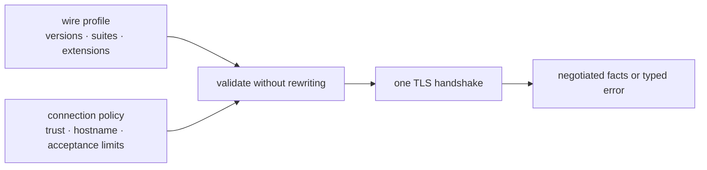

# TLS security boundary

Phantom treats TLS wire behavior and connection acceptance as separate
concerns. A profile describes what a captured client offered. Connection
policy will constrain what the public client is willing to negotiate.

This separation matters because real browser captures can contain CBC suites,
RSA key-exchange suites, 3DES, or older TLS versions. Removing those values
would change the advertised fingerprint. Keeping them in a profile is not a
security rating or a recommendation to negotiate them.

## Current behavior

The current TCP TLS path:

- validates the profile before network I/O;
- verifies the certificate chain against the configured WebPKI roots;
- verifies the hostname and sends SNI;
- returns configuration and handshake failures instead of silently retrying
  with a different version, suite list, protocol, or route;
- retains typed negotiated TLS versions and cipher suites and records their
  public names without logging secrets; and
- does not expose TLS record compression.

Certificate compression is a different TLS feature: it compresses public
certificate messages, not application data mixed with secrets.

`TlsSettings` currently supplies both the advertised version range and cipher
suite list directly to BoringSSL. Therefore an exact profile can negotiate a
legacy option if the server also selects it. Callers that require a restricted
set must customize those fields before building the connector. Phantom does
not yet expose a separate public connection-policy type.

The QUIC path is TLS 1.3 only. Session resumption and 0-RTT remain disabled
until the session cache, replay policy, and request eligibility rules exist.
BoringSSL owns TLS record sequence numbers and nonce construction; Phantom
does not recreate record protection.

## Planned policy seam

The public client will resolve a wire profile and connection policy before an
attempt starts. A conflict returns a typed error. Policy never mutates the
profile behind the caller's back, because that would make both pooling identity
and packet differentials dishonest.

The first policy slice should be deliberately small:

- minimum accepted TLS version;
- allowed negotiated cipher suites;
- certificate and hostname verification inputs; and
- resumption and early-data policy once session state exists.

Negotiated TLS version, cipher suite, ALPN, resumption, and early-data status
belong in structured diagnostics. Private keys, traffic secrets, tickets,
cookies, authorization fields, and proxy credentials do not.

## Review checklist

The [rustls TLS vulnerability review](https://docs.rs/rustls/latest/rustls/manual/_02_tls_vulnerabilities/index.html)
is a useful protocol checklist, not a claim about Phantom's BoringSSL backend.
TLS work is reviewed for CBC timing behavior, RSA key exchange, protocol
downgrade and fallback, record compression, export and static-DH suites,
64-bit block ciphers, GCM nonce construction, renegotiation, and Extended
Master Secret behavior where applicable.

Tests must prove the behavior Phantom owns: no automatic downgrade retry,
explicit negotiated-version and cipher observability, rejection of
profile-policy conflicts before I/O, TLS 1.3 enforcement for QUIC, and absence
of secrets from ordinary tracing. Backend cryptographic claims remain backed
by the selected backend's documentation and tests rather than being inferred
from another TLS implementation.
